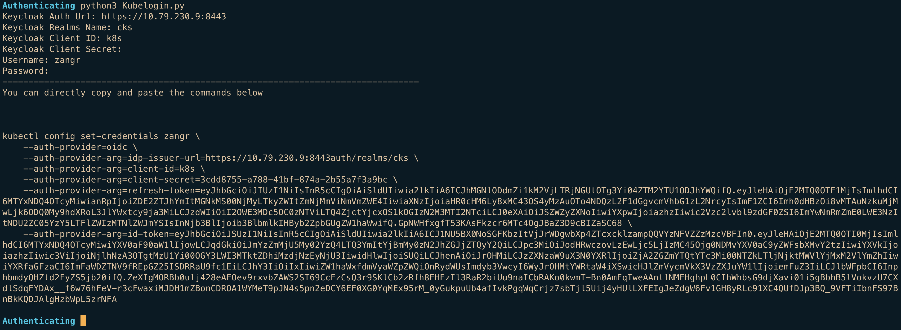

# Keycloak-K8s-LoginScript
 
一个Python脚本, 交互输入OIDC认证信息, 输出Kubectl Config配置文本, 自行粘贴一遍命令即可. 
目前只验证过Keycloak作为OAuth 2.0服务端.
 
 
=================================================================================
 
K8s OIDC interactive login script, generated credentials can be directly pasted.
 
 

